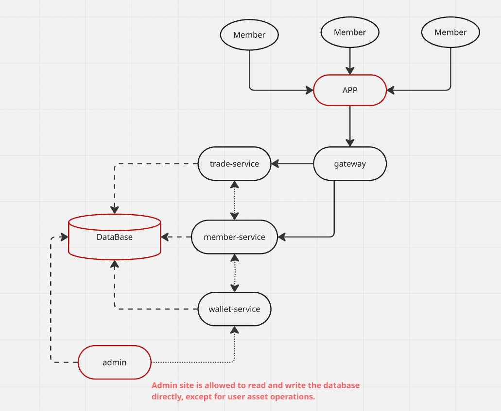
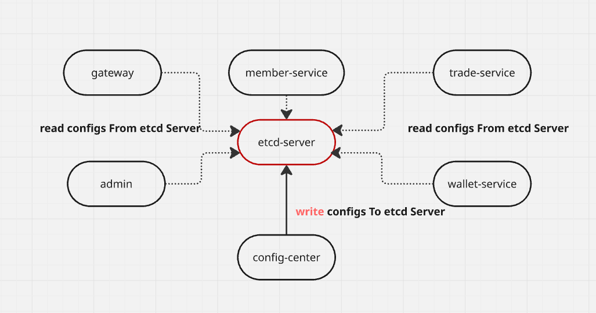

# Wallet网关

## 开发规范
1、可以直连`redis`，不可直连`DB`。

2、所有RPC调用都通过`common-lib`仓库的`rpcx`访问函数。

3、调用顺序：`internal/router` -> `internal/handler` --> `common-lib/rpcx/`

4、不使用`Restful`标准，只可使用`GET/POST`，`POST`用`Json-Body`的方式传参

5、与前端对接的所有字段都使用蛇形，不要使用驼峰。

## 

*项目结构说明*

*配置中心*

